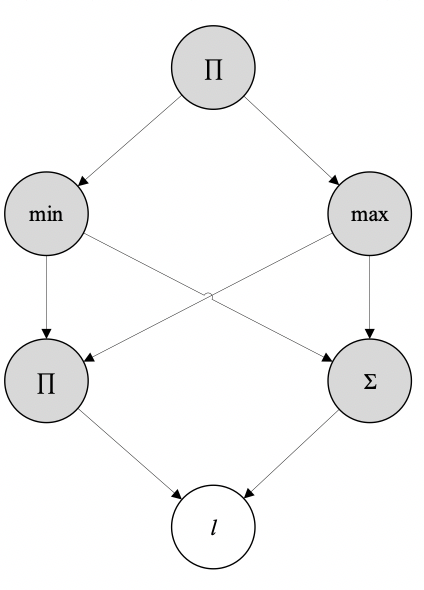

# Задание

Написать программу, реализующую решение поставленной задачи в многопоточном режиме. Программа может быть написана на любом статически типизированном компилируемом языке. Интерфейс реализации может быть любым, удовлетворяющим требованиям задания.

Около каждого пункта задания написано, сколько баллов за него возможно получить. В сумме за задание 100 баллов. Общие требования ко всем вариантам заданий:
1. [5] Соблюдение code-style выбранного языка программирования.
1. [10] Удобство использования программы: вывод всех важных для использования программы параметров, удобный интерфейс с графиками.
1. [5] Качество кода в целом: используемые структуры данных, характеристики алгоритмов.
1. [20] Сделать две реализации: использующую библиотечные структуры данных и методы и не использующую. Построить графики зависимости времени выполнения задачи от размера входных данных и проанализировать качество собственной реализации.

## Варианты

### 1. Операции над матрицами

**Дано.** Расчёт суммы двух матриц, произведения матрицы на число и произведения двух матриц.

**Задачи:**
1. [30] Сделать однопоточную реализацию и многопоточную.
1. [5] Выводить на экран прогресс вычислений в целом.
1. [5] Выводить статистику по вычислениям: количество потоков, количество подзадач, количество подзадач, выполненных отдельным потоком.
1. [20] Реализовать калькулятор на матрицах. Данные извлекать из csv-файлов.

### 2. Расчёт статистических характеристик данных

**Дано.**  Имеется множество файлов, которые содержат числовые данные результатов некого эксперимента. Размер каждого отдельного файла <100Kb. Суммарный объём файлов >2Gb. 

**Задачи:**
1. [30] Найти выборочное среднее, выборочную дисперсию, медиану и моду всего массива данных.
1. [15] Удовлетворить ограничению по используемой оперативной памяти в размере 1Gb.
1. [10] Построить гистограмму массива данных.
1. [5] Построить график зависимости времени выполнения вычислений от количества потоков. Указать при этом количество ядер (физических и виртуальных) на используемом при вычислениях процессоре.

### 3. Реляционная алгебра

**Дано.** Имеются таблицы с данными.

**Задачи:**
1. [20] Реализовать операции проекции и ограничения.
1. [20] Реализовать операцию соединения.
1. [20] Пусть исходные данные расположены в csv-файлах. Реализовать простой язык запросов (можно использовать SQL-синтаксис) для манипуляции такими таблицами.

### 4. Декомпозиция и диспетчеризация задач в среде параллельных вычислений

**Дано.** Вычислительная задача представляется направленным ациклическим графом (в частном случае, деревом), в котором каждый узел представляет собой элементарную задачу, а связи между узлами означают передачу результатов решения одной задачи на вход другой. Например: пусть $`l`$ – некоторый список чисел, тогда приведенный ниже граф изображает структуру следующей задачи: $`\prod(\min⁡(\sum l,\prod l),\max⁡(\sum l,\prod l))`$:

Направление стрелок показывает функциональную зависимость. По мере того, как вычисляются значения узлов, такие узлы исключаются из графа. Например, в приведенной схеме узел, отмеченный $`l`$, считается исключенным, т.к. его значение известно – это список $`l`$. Это значение затем используют два различных узла – они отмечены $`\prod`$ и $`\sum`$; эти узлы считаются минимальными; поскольку они не сравнимы (если принять, что изображенная схема является отношением частичного порядка, а такое допущение приемлемо, т.к. выполнены, по крайней мере, свойства транзитивности и антисимметричности), – т.е. независимы – соответствующие вычисления можно выполнять параллельно, в различных потоках. Те же соображения справедливы по отношению к узлам, отмеченным $`\min`$ и $`\max`$. Следует обратить внимание, что вычисление $`\min`$ и $`\max`$ (как и вообще любого узла) не может начаться, пока не вычислены значения для всех узлов, от которых они зависят (т.е. для меньших элементов). Таким образом, распараллеливаются всегда минимальные (в указанном смысле) элементы.

**Задачи:**
1. [30] Написать процедуру декомпозиции вычислительных задач. Входом для нее может быть, например, абстрактное синтаксическое дерево. Выходом – направленный ациклический граф, упорядочивающий выполнение отдельных операций.
2. [30] Реализовать диспетчер, который доступные задачи (т.е. такие, которые являются на данный момент минимальными элементами) распределяет между исполняющими потоками. Возможны два варианта реализации:
    * число потоков заранее фиксировано,
    * количество потоков подстраивается под количество доступных задач.
