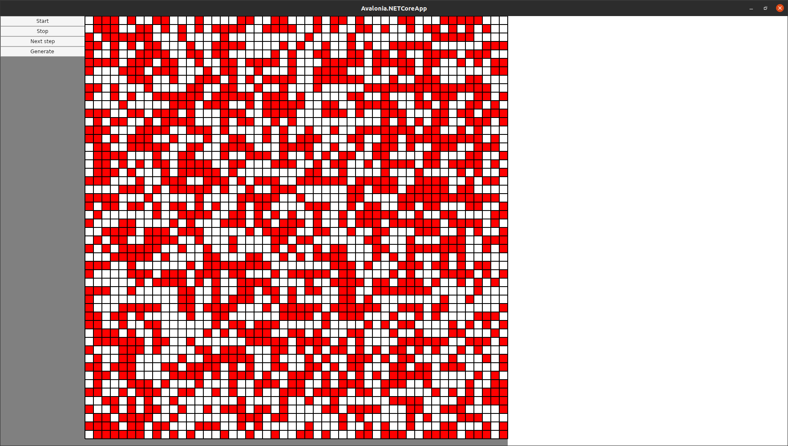

# Разработка системы описания и исполнения клеточных автоматов

> Вариант №6

## Техническая документация

### Описание алгоритма

Рассмотрим квадратную матрицу $A$ порядка $n$, элементы которой принадлежат некоторому фиксированному множеству $T$, которое будет называть множеством цветов (а элементы этого множества – цветами). Этому множеству $T$, в частности, принадлежит элемент  - белый цвет.

Пусть $f:T$ $\rightarrow T$ – некоторое отображение. Тогда работу клеточного автомата можно описать как вычисление на каждом шаге новой матрицы $A^{(i)} = A^{(i-1)}\times(f*E_n)$, где  $E_n$– единичная матрица порядка $n$. Т.е. отображение $f$ применяется к каждому элементу $a^{(i-1)}_{ij}$ матрицы $A^{(i-1)}$, и строится новая матрица $A^{(i)}=(f(a^{(i-1)}_{ij}))$.

Отображение $f$ может быть произвольным, однако интерес представляют отображения, которые учитывают предыдущее состояние соседних с  элементов – расположенных по горизонтали, вертикали и диагоналям на расстоянии 1 или более. Одним из самых известных примеров клеточных автоматов является игра «Жизнь».

Все вычесления связанные с вычеслением следущего состояния происходят парралельно с помощью использования класса Task.

## Пользовательская документация

### Сборка

Собрать проект можно с помощью команды `dotnet publish` будучи находясь в каталоге с решением `task/ConsoleTestDotNetCore`. Собранное приложение будет находиться по пути `task/ConsoleTestDotNetCore/Avalonia.NETCoreApp/bin/Debug/netcoreapp3.1/publish/`

### Запуск

Запустить приложение можно с помощью команды `./Avalonia.NETCoreApp` находясь в одном каталоге с ним.

### Использование

После запуска приложение вас встретит пользовательский интерфейс:

* Кнопка `Start` - запуск автомата с исходного состояния;
* Кнопка `Stop` - остановка автомата;
* Кнопка `Next step` - переход к следущему состоянию;
* Кнопка `Generate` - геренация нового состояния;
* Поле клеток - визуальное отоброжения текущего состояния автомата.

    Есть возможность изменения состояния автомата в ручную, для этого:
    1. Остановите автомат.
    2. Нажмите на нужные клетки для смены их состояние на обратное.
